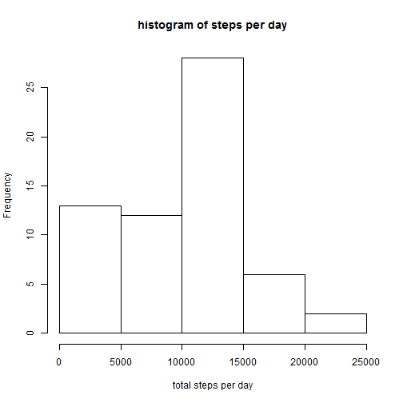
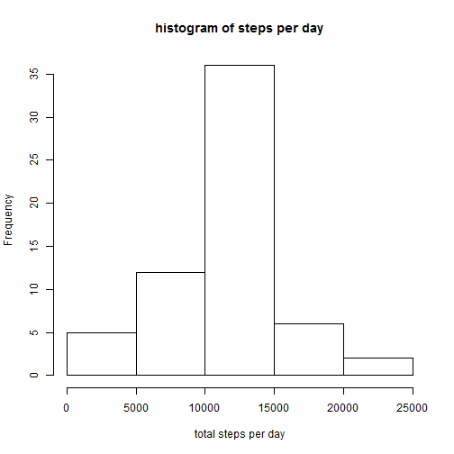
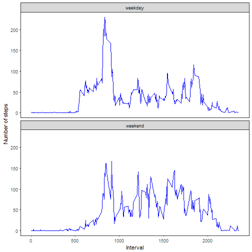

# Activity Mornitoring Devices : Peer Assessment 
Introduction
It is now possible to collect a large amount of data about personal movement using activity monitoring devices such as a Fitbit, Nike Fuelband, or Jawbone Up. These type of devices are part of the "quantified self" movement - a group of enthusiasts who take measurements about themselves regularly to improve their health, to find patterns in their behavior, or because they are tech geeks. But these data remain under-utilized both because the raw data are hard to obtain and there is a lack of statistical methods and software for processing and interpreting the data.

This assignment makes use of data from a personal activity monitoring device. This device collects data at 5 minute intervals through out the day. The data consists of two months of data from an anonymous individual collected during the months of October and November, 2012 and include the number of steps taken in 5 minute intervals each day.

## Data
The data for this assignment can be downloaded from the course web site:

Dataset: Activity monitoring data [52K]  
The variables included in this dataset are:  

-steps: Number of steps taking in a 5-minute interval (missing values are coded as NA)  
-date: The date on which the measurement was taken in YYYY-MM-DD format  
-interval: Identifier for the 5-minute interval in which measurement was taken  
-The dataset is stored in a comma-separated-value (CSV) file and there are a total of 17,568 observations in this dataset.  

## Load the data

```r
activity <- read.csv("~/activity.csv")
```

## What is mean total number of steps taken per day?
First, the total (sum) of steps is determined for every single day

```r
stsum <- tapply(activity$steps,activity$date,sum,na.rm=TRUE)
```

Histogram of the total number of steps taken each day

```r
hist(stsum,xlab="total steps per day",main="histogram of steps per day")
```



The mean and the median total number of steps taken per day are reported :


```r
stmean <- mean(stsum)
stmedian <- median(stsum)
print(c("The mean is",stmean))
```

```
## [1] "The mean is"      "9354.22950819672"
```

```r
print(c("The median is ",stmedian))
```

```
## [1] "The median is " "10395"
```


##What is the average daily activity pattern?

```r
stint <- tapply(activity$steps,activity$interval,mean,na.rm=TRUE)
plot(stint ~ unique(activity$interval),type="l",xlab="5-min interval")
```


## Which 5-minute interval, on average across all the days in the dataset, contains the maximum number of steps?

```r
stint[which.max(stint)]
```

```
##      835 
## 206.1698
```

## Note that there are a number of days/intervals where there are missing values (coded as NA). The presence of missing days may introduce bias into some calculations or summaries of the data.

Calculate and report the total number of missing values in the dataset (i.e. the total number of rows with NAs)

```r
table(is.na(activity) == TRUE)
```

```
## 
## FALSE  TRUE 
## 50400  2304
```

To find out which variable has the NA's 

```r
summary(activity)
```

```
##      steps                date          interval     
##  Min.   :  0.00   2012-10-01:  288   Min.   :   0.0  
##  1st Qu.:  0.00   2012-10-02:  288   1st Qu.: 588.8  
##  Median :  0.00   2012-10-03:  288   Median :1177.5  
##  Mean   : 37.38   2012-10-04:  288   Mean   :1177.5  
##  3rd Qu.: 12.00   2012-10-05:  288   3rd Qu.:1766.2  
##  Max.   :806.00   2012-10-06:  288   Max.   :2355.0  
##  NA's   :2304     (Other)   :15840
```
All of the NA's are in the steps variable. There are 2304 NA's

## Strategy for filling in missing values
The mean of the steps corresponding to that interval is taken as the replacing value.
We should find the right interval mean from the stint variable.


```r
activity2 <- activity # creation of dataset with no more NA
for ( i in 1:nrow(activity)) {
  if (is.na(activity$steps[i])) {
    activity2$steps[i] <- stint[[as.character(activity[i,"interval"])]]
  }
}
```
Histogram of steps taken each day.

```r
stsum2 <- tapply(activity2$steps,activity2$date,sum,na.rm=TRUE)
hist(stsum2,xlab="total steps per day",main="histogram of steps per day")
```



The mean and the median total number of steps taken per day are reported :


```r
stmean2 <- mean(stsum2)
stmedian2 <- median(stsum2)
print(c("The mean without NA is",stmean2))
```

```
## [1] "The mean without NA is" "10766.1886792453"
```

```r
print(c("The median is without NA",stmedian2))
```

```
## [1] "The median is without NA" "10766.1886792453"
```

##Comparison between old and new mean and median values :

```r
print(c("The mean is",stmean))
```

```
## [1] "The mean is"      "9354.22950819672"
```

```r
print(c("The mean without NA is",stmean2))
```

```
## [1] "The mean without NA is" "10766.1886792453"
```

```r
print(c("The median is ",stmedian))
```

```
## [1] "The median is " "10395"
```

```r
print(c("The median is without NA",stmedian2))
```

```
## [1] "The median is without NA" "10766.1886792453"
```

## Weekday and Weekend patterns

```r
activity2$weekday <- c("weekday")
activity2[weekdays(as.Date(activity2[,2])) %in% c("Saturday","Sunday","saturday","sunday"),"weekday"] <- c("weekend")
table(activity2$weekday == "weekend")
```

```
## 
## FALSE  TRUE 
## 12960  4608
```

## Factor variable for weekday

```r
activity2$weekday <- factor(activity2$weekday)
```

## subsetting the dataset based on weekday or weekend

```r
activity2_weekend <- subset(activity2, activity2$weekday == "weekend")
activity2_weekday <- subset(activity2, activity2$weekday == "weekday")
mean_activity2_weekday <- tapply(activity2_weekday$steps, activity2_weekday$interval, mean)
mean_activity2_weekend <- tapply(activity2_weekend$steps, activity2_weekend$interval, mean)
```
Dataframe has to be prepared for plotting

```r
df_weekday <- data.frame(interval = unique(activity2_weekday$interval),avg=as.numeric(mean_activity2_weekday),day=rep("weekday",length(mean_activity2_weekday)))
df_weekend <- data.frame(interval = unique(activity2_weekend$interval),avg=as.numeric(mean_activity2_weekend),day=rep("weekend",length(mean_activity2_weekend)))
df_final <- rbind(df_weekday,df_weekend)

library(ggplot2)
g<-ggplot(df_final,aes(interval,avg))
#g+geom_line()+facet_grid(.~day)
g<-ggplot(df_final,aes(interval,avg))+geom_line(col="blue")+facet_wrap(~day,nrow=2)+labs(x="Interval",y="Number of steps")
#g+theme_bw()
g+theme_bw()+theme(panel.grid=element_blank())
```


